# 1

Q: 为什么现代应用程序必须使用多核来提升性能？

A: 从 2000 年左右开始，CPU 时钟频率不再增长，单线程性能达到极限。但晶体管数量仍在增加，所以处理器的核数开始增加。想要跑得更快，只能依赖多核并行。

GROUP: MIT 6.S081 Lec10

# 2

Q: 锁的核心矛盾是什么？

A: 出于正确性（避免 race condition）必须使用锁，但锁会将并行访问序列化，反过来限制了性能。我们想要并行获得高性能，但锁又迫使代码串行执行。

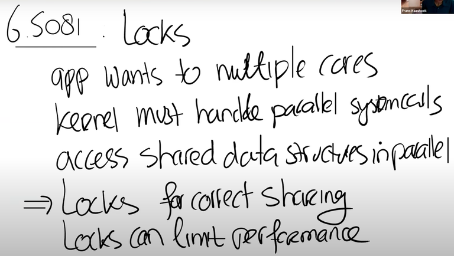

GROUP: MIT 6.S081 Lec10

# 3

Q: 在 kfree 的例子中，不加锁时 race condition 是如何发生的？

A: 两个 CPU 同时调用 kfree 释放 page：
1. CPU0 和 CPU1 各自的 r->next 都指向当前 freelist（同一个 head）
2. CPU0 先执行 `kmem.freelist = r`，freelist 指向 CPU0 的 page
3. CPU1 再执行 `kmem.freelist = r`，freelist 被覆盖为 CPU1 的 page
4. 结果：CPU0 的 page 丢失，未出现在 freelist 中

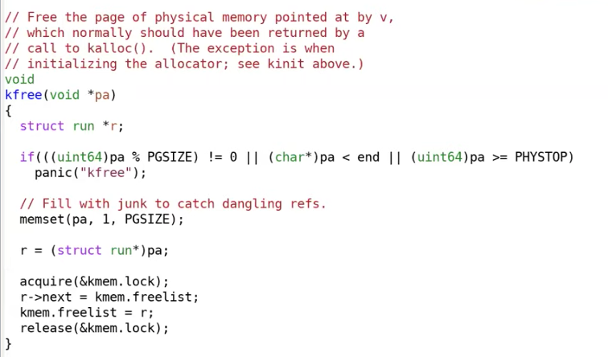

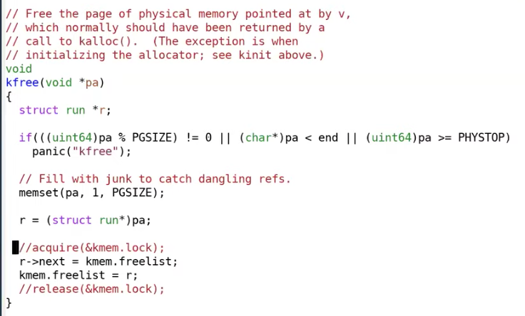

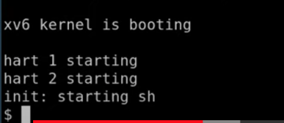

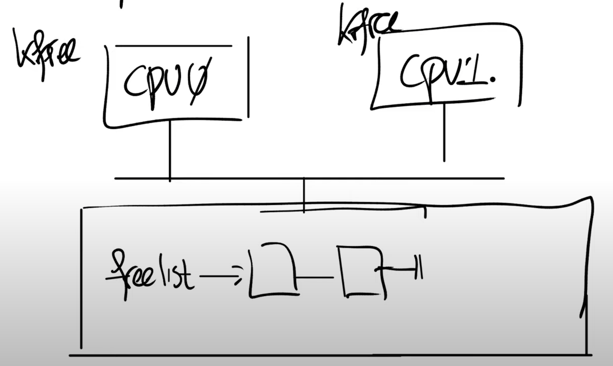

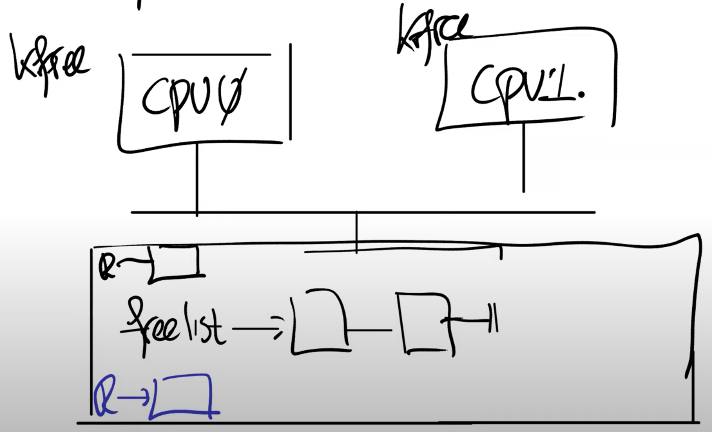

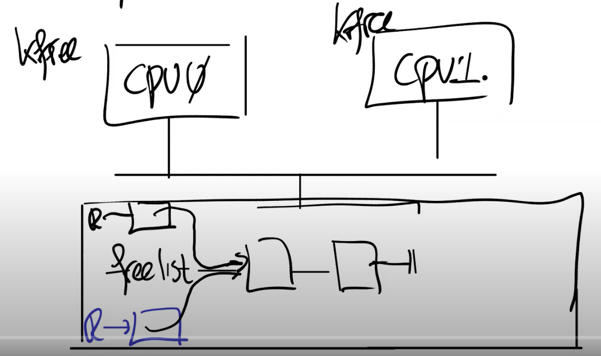

GROUP: MIT 6.S081 Lec10

# 4

Q: race condition 有哪些特点？

A: 1. 不一定会发生——取决于多个 CPU 是否恰好交错执行
2. 表现形式多样——可能 panic，也可能默默丢失数据
3. CPU 核数越多，可能出现越奇怪的现象

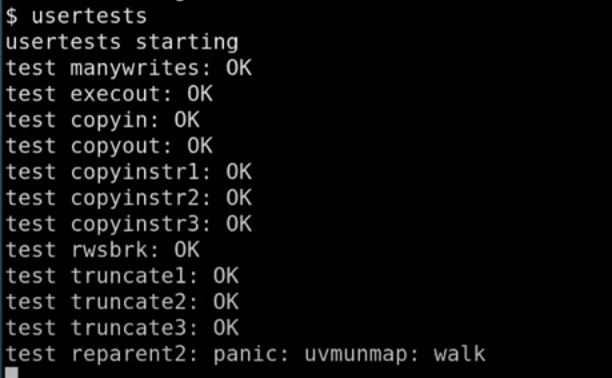

GROUP: MIT 6.S081 Lec10

# 5

Q: 锁的 API 是什么？各自的含义？

A: - acquire：获取锁。确保任何时间只有一个进程能成功获取
- release：释放锁。等待该锁的其他进程在 release 之后才能继续
- acquire 和 release 之间的代码称为 critical section（临界区）

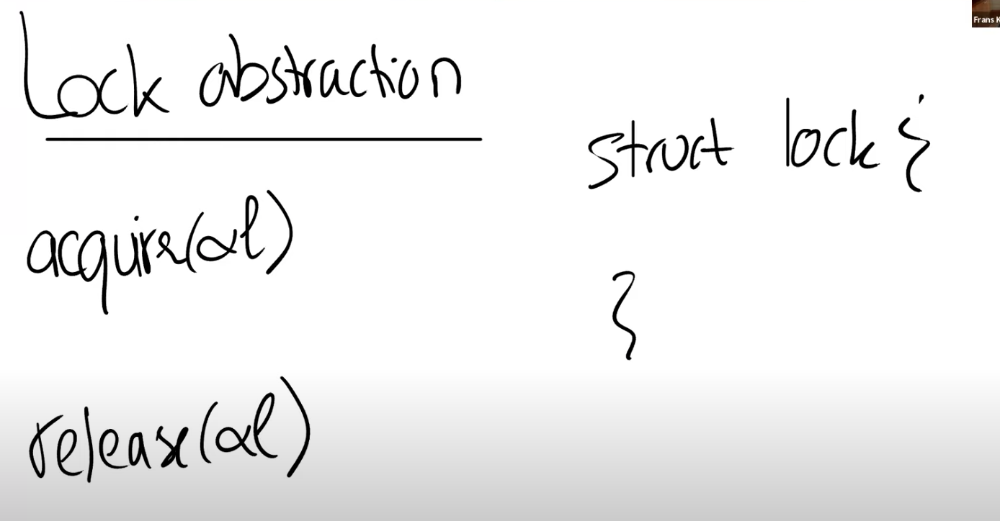

GROUP: MIT 6.S081 Lec10

# 6

Q: 什么是 critical section（临界区）？

A: acquire 和 release 之间的代码区域。临界区内的多条指令要么一起执行，要么一条也不执行，不会在多个 CPU 上交织执行，从而避免 race condition。

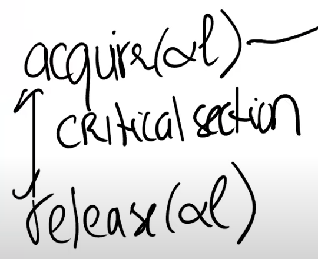

GROUP: MIT 6.S081 Lec10

# 7

Q: 为什么内核需要多把锁而不是一把 big kernel lock？

A: 如果只有一把大锁，所有系统调用都会被序列化，即使它们访问的是完全不相关的数据。使用多把锁可以让访问不同数据结构的系统调用完全并行运行，提高并发度。

GROUP: MIT 6.S081 Lec10

# 8

Q: 什么时候必须加锁？给出保守规则。

A: 如果两个进程访问了同一个共享数据结构，且其中一个进程会更新该数据，就需要加锁。

注意：这条规则有时太严格（lock-free 程序可以不用锁），有时又太宽松（如 printf 没有共享数据但也需要锁来保证输出的序列化）。

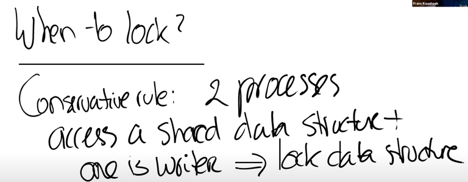

GROUP: MIT 6.S081 Lec10

# 9

Q: 为什么不能对每个数据结构自动加锁？

A: 以 rename 为例（将 d1/x 移到 d2/y）：先锁 d1 删除 x 再解锁，然后锁 d2 创建 y 再解锁。中间状态下文件看起来完全不存在，这是错误的结果。正确的做法是一次性锁住 d1 和 d2，在操作完成后再释放两者。锁应该与操作关联，而非简单地与每个数据对象绑定。

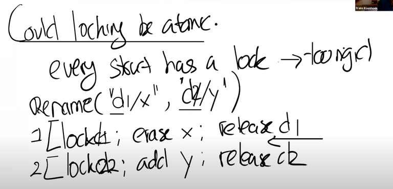

GROUP: MIT 6.S081 Lec10

# 10

Q: 锁的三种作用是什么？

A: 1. 避免丢失更新——防止如 kfree 中 page 丢失的情况
2. 打包多个操作为原子操作——临界区内所有操作作为整体执行
3. 维护共享数据结构的不变性——acquire 后暂时破坏不变量，release 前恢复

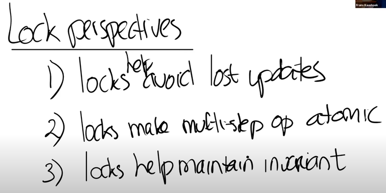

GROUP: MIT 6.S081 Lec10

# 11

Q: 什么是死锁（Deadlock）？最简单的例子是什么？

A: 死锁：程序卡住，永远无法继续执行。

最简单例子：acquire 一个锁后，在临界区内再次 acquire 同一个锁。第二次 acquire 等待第一次 release，但不继续执行又走不到 release，形成死循环。XV6 会探测这种情况并触发 panic。

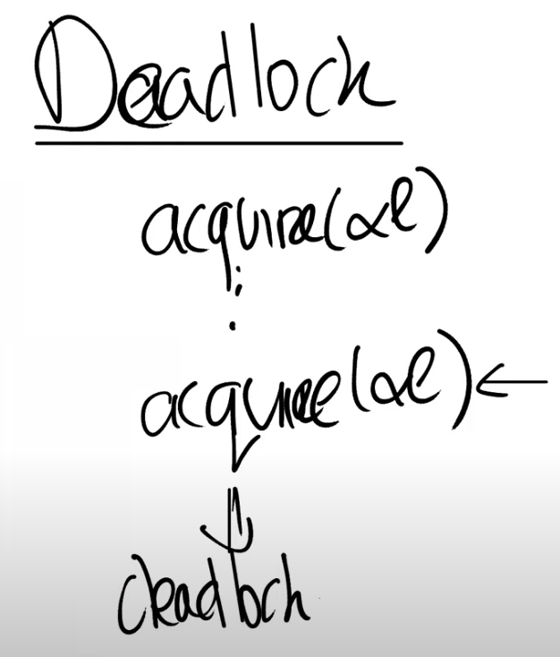

GROUP: MIT 6.S081 Lec10

# 12

Q: 多锁场景下的死锁（deadly embrace）是如何发生的？

A: CPU1 先锁 d1 再等 d2，CPU2 先锁 d2 再等 d1。双方各持一把对方需要的锁，互相等待，谁也无法继续。

解决方案：对所有锁进行全局排序，所有操作必须以相同顺序获取锁。

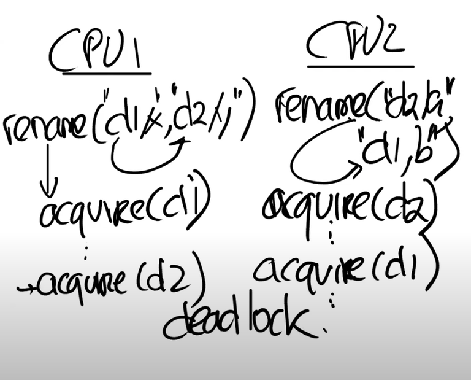

GROUP: MIT 6.S081 Lec10

# 13

Q: 全局锁排序带来了什么工程上的问题？

A: 破坏了模块化抽象。如果模块 m1 调用模块 m2，m1 必须知道 m2 内部使用了哪些锁，才能正确排序。这意味着 m2 的实现细节（锁）必须泄露给 m1，违背了代码封装原则。

GROUP: MIT 6.S081 Lec10

# 14

Q: 锁与性能的权衡关系是什么？

A: 想要更高性能，就需要拆分数据结构和锁（fine-grained locking），让更多操作并行。但这涉及大量重构工作，需要维持数据不变量，代码变复杂。更多锁 = 更好的并行性 ≠ 更简单的代码。

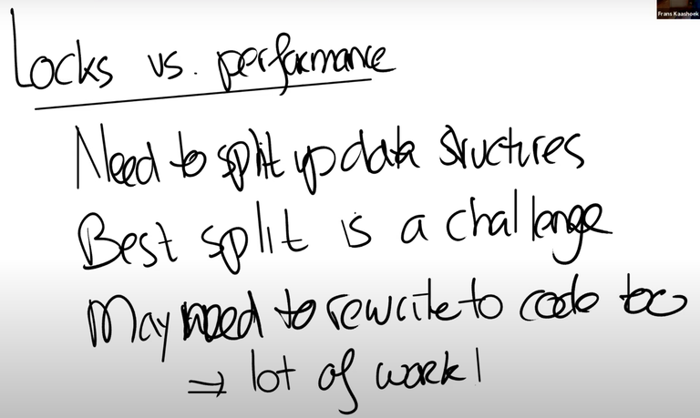

GROUP: MIT 6.S081 Lec10

# 15

Q: 锁设计的推荐开发流程是什么？

A: 1. 先从 coarse-grained lock（大锁）开始
2. 测试程序是否能利用多核
3. 如果性能足够，结束；如果存在锁竞争（多个进程争同一把锁导致序列化），再重构为 fine-grained lock

关键：不是必要就不要重构，因为引入更多锁会大幅增加复杂度。

GROUP: MIT 6.S081 Lec10

# 16

Q: XV6 的 UART 模块使用锁保护了哪些东西？

A: 一把锁保护了：
- 传输缓存（buffer）
- 写指针（uart_tx_w）
- 读指针（uart_tx_r）
- UART 硬件寄存器 THR（确保只有一个写入者）

这是 coarse-grained lock 设计，遵循消费者-生产者模式。

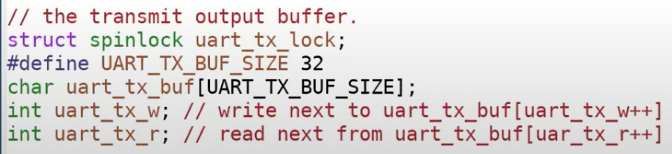

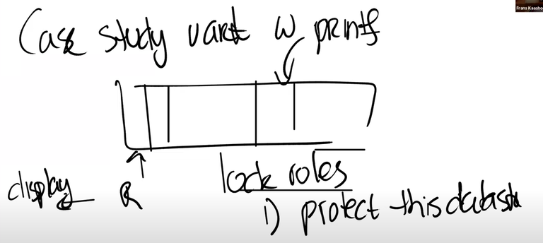

GROUP: MIT 6.S081 Lec10

# 17

Q: UART 的中断处理程序为什么也需要获取锁？

A: UART 中断可能与调用 printf 的进程在不同 CPU 上并行执行，二者都会调用 uartstart 操作 THR 寄存器和传输缓存。如果不加锁，中断处理程序和 uartputc 可能同时写入，破坏数据一致性。

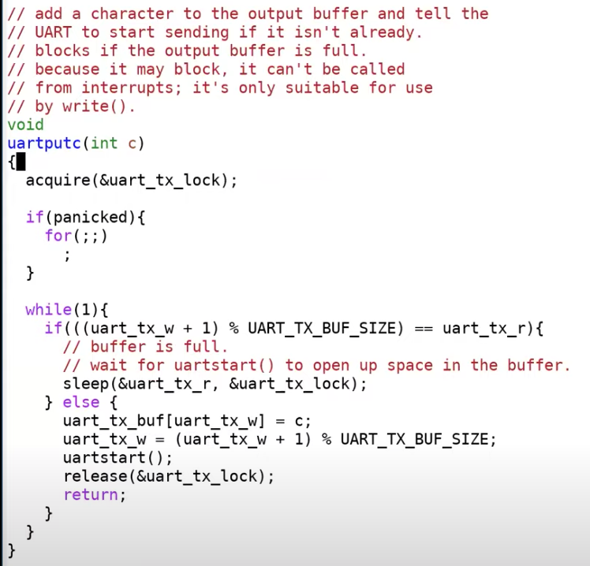

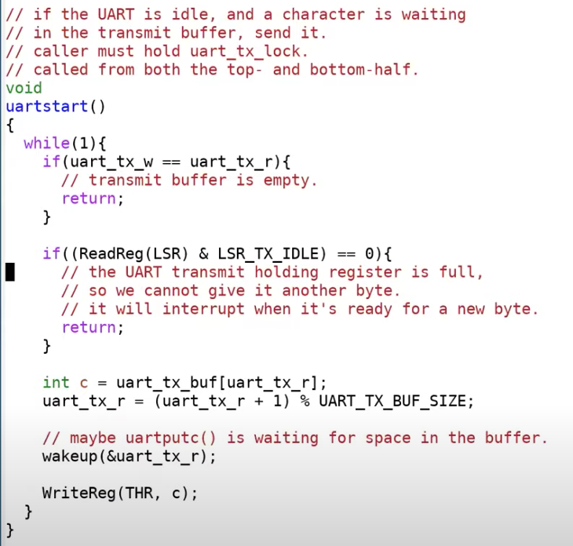

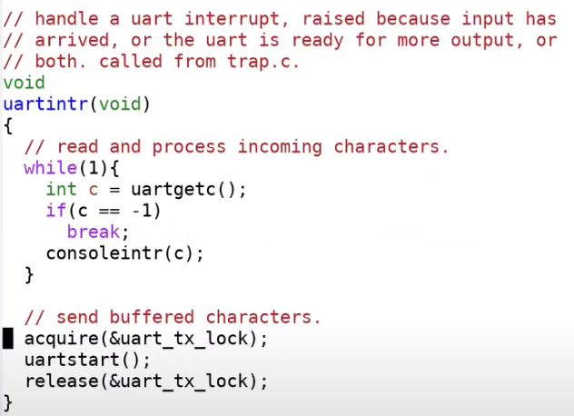

GROUP: MIT 6.S081 Lec10

# 18

Q: 用普通循环实现自旋锁（读 locked 字段 + 置 1）有什么问题？

A: 存在 race condition：CPU0 和 CPU1 可能同时读到 locked 为 0，然后同时将其置为 1，都认为自己获取了锁。违背了"同时只有一个持有者"的锁特性。

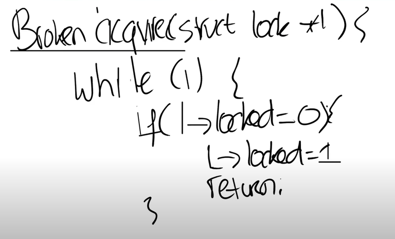

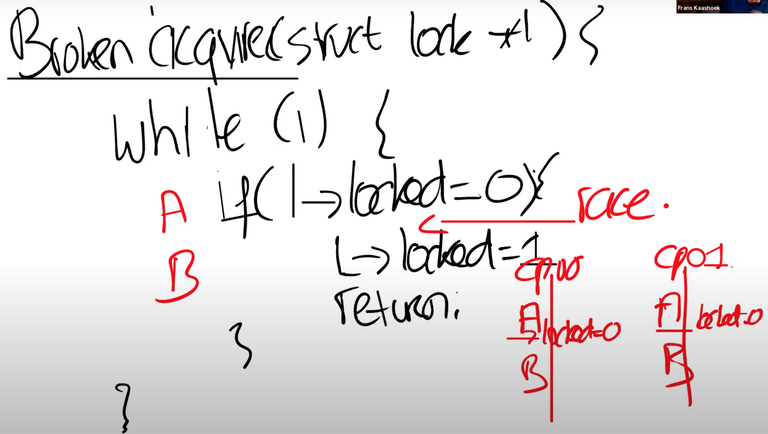

GROUP: MIT 6.S081 Lec10

# 19

Q: RISC-V 的 amoswap 指令是如何工作的？

A: amoswap（atomic memory swap）接收 address, r1, r2 三个参数：
1. 锁定地址
2. 将 address 中的数据保存到临时变量 tmp
3. 将 r1 的值写入 address
4. 将 tmp 写入 r2
5. 解锁地址

整个过程原子执行，实现了 test-and-set。

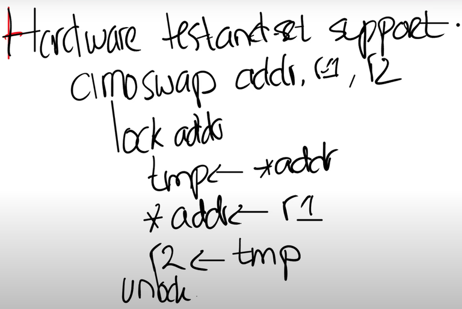

GROUP: MIT 6.S081 Lec10

# 20

Q: 硬件层面如何实现原子指令？

A: 三种可能的实现方式：
1. 内存控制器：对特定地址加锁，让一个处理器完成多个操作再解锁
2. 总线控制器：在共享总线上以原子方式执行多个内存操作
3. 缓存一致性协议：对持有目标数据的 cache line 加锁，确保只有一个写入者

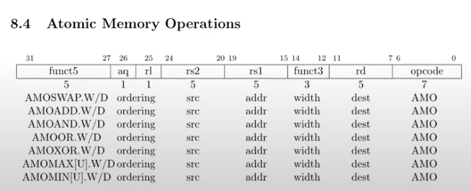

GROUP: MIT 6.S081 Lec10

# 21

Q: XV6 的 acquire 函数是如何使用 test-and-set 实现自旋锁的？

A: while 循环中调用 `__sync_lock_test_and_set`：
- 如果 locked 为 0：写入 1，返回旧值 0 → 获取锁成功，退出循环
- 如果 locked 为 1：写入 1（无变化），返回旧值 1 → 锁被持有，继续 spin

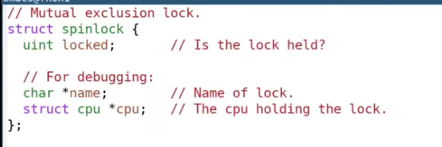

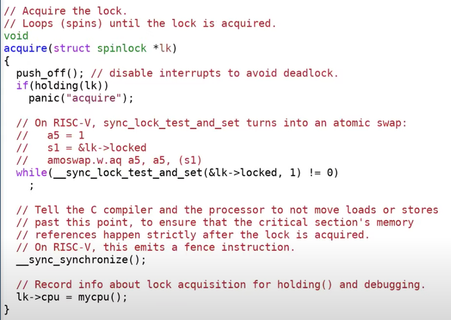

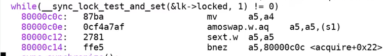

GROUP: MIT 6.S081 Lec10

# 22

Q: release 函数为什么不能直接用 store 指令将 locked 写为 0？

A: store 指令不一定是原子的。例如对于 CPU 缓存，一个 store 可能包含"加载 cache line + 更新 cache line"两个微操作，可能被其他 CPU 的写入干扰。必须使用硬件原子指令（如 amoswap）来确保写入的原子性。

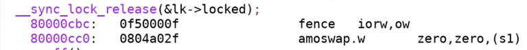

GROUP: MIT 6.S081 Lec10

# 23

Q: acquire 函数为什么要先关闭中断？

A: 防止同一 CPU 上的死锁。例如 uartputc 持有锁时，如果 UART 硬件完成传输触发中断，中断处理程序 uartintr 会尝试获取同一把锁。如果中断不关闭，同一 CPU 就会死锁（持有锁等自己释放）。中断在 release 末尾重新打开。

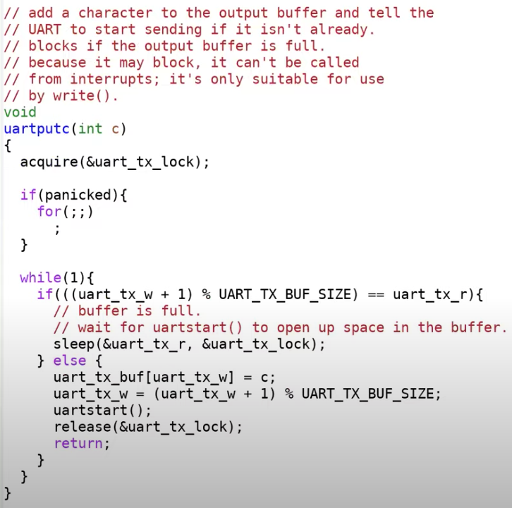

GROUP: MIT 6.S081 Lec10

# 24

Q: spinlock 需要处理哪两类并发？

A: 1. 不同 CPU 之间的并发——多个 CPU 同时 acquire 同一把锁
2. 同一 CPU 上中断与普通程序之间的并发——中断处理程序可能与当前持有锁的代码争抢同一把锁

GROUP: MIT 6.S081 Lec10

# 25

Q: 什么是 memory ordering 问题？锁如何解决？

A: 编译器或 CPU 可能为了性能重排指令顺序。在并发场景下，如果将临界区内的操作移到锁外，会导致错误。解决方案是 memory fence（`__sync_synchronize`）——在 acquire 和 release 中调用，确保临界区内的指令不会越界执行。

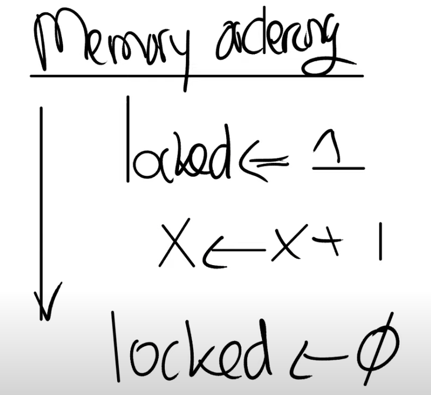

GROUP: MIT 6.S081 Lec10

# 26

Q: memory fence 的指令边界是如何划分的？

A: acquire 和 release 各有自己的 `__sync_synchronize` 调用点作为边界：
- acquire 之前的指令 → 不能越过 acquire 的 fence
- 两个 fence 之间的指令（临界区） → 保持在两个 fence 之间
- release 之后的指令 → 不能越过 release 的 fence 往前移

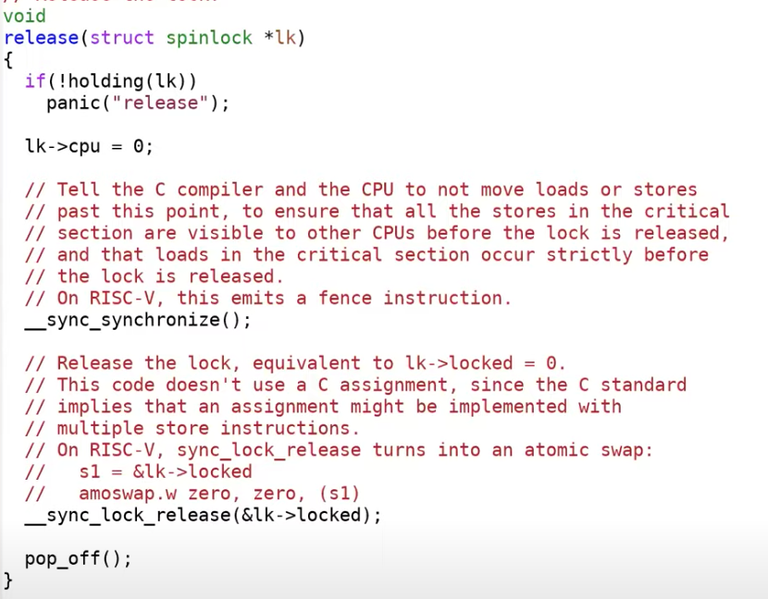

GROUP: MIT 6.S081 Lec10

# 27

Q: 如何从根本上避免锁带来的复杂性？

A: 不到万不得已不要共享数据。如果不在多个进程间共享数据，race condition 就不可能发生，也就不需要锁。但如果确实有共享数据结构，就从 coarse-grained lock 开始，基于测试结果逐步演进到 fine-grained lock。

GROUP: MIT 6.S081 Lec10
