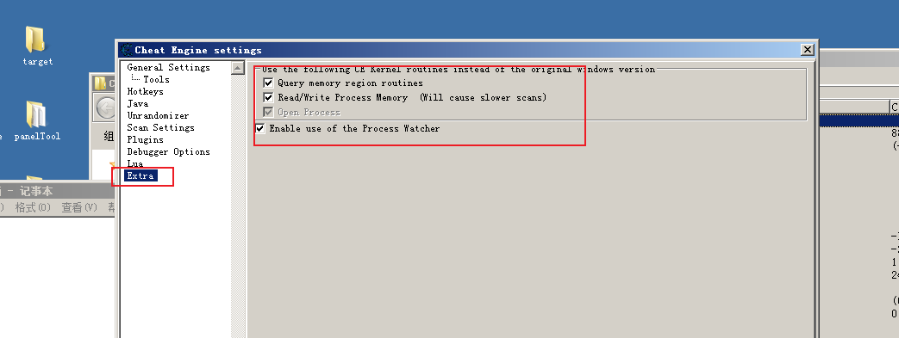
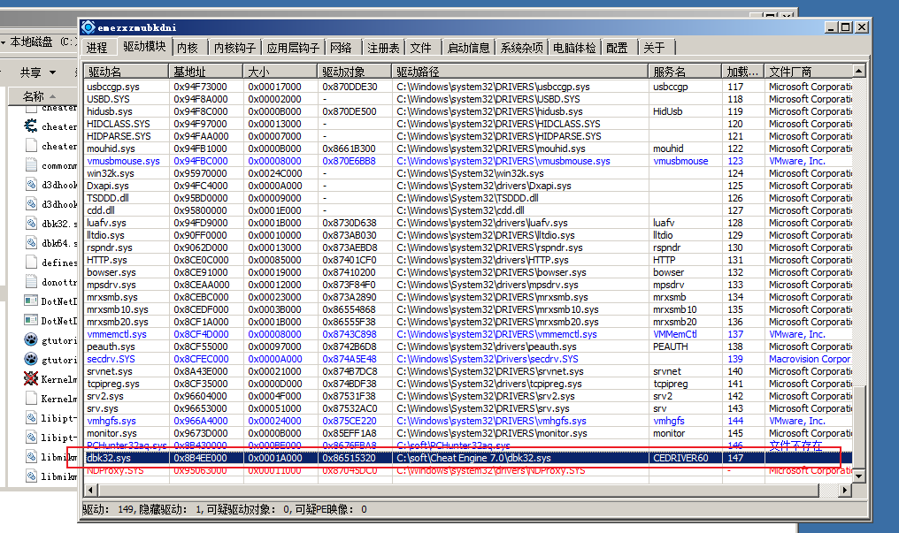
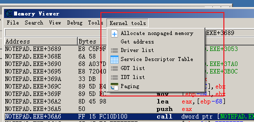
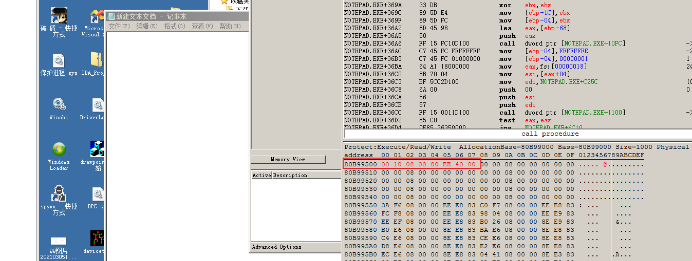
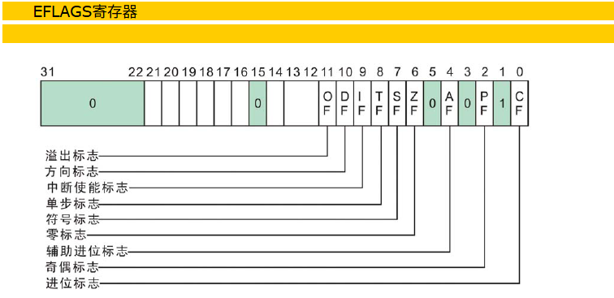
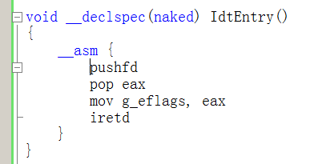
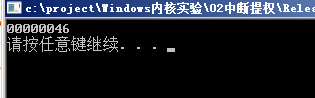
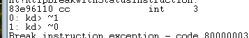
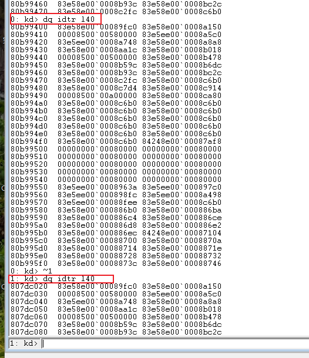

# 1

Q： 用CE修改内核内存（高2G内存），CE需要做什么设置，设置完之后会怎么样？

A：

全部设置，不然无法找到内核地址

打开就会加载这个驱动程序



然后这里就可以使用了


解释：

这是在开启 Cheat Engine 的**内核级（Kernel/Driver）内存操作模式**。

简单来说，正常情况下 CE 通过 Windows 标准 API（如 `ReadProcessMemory`/`WriteProcessMemory`）读写游戏内存。但勾选这些选项后，CE 会**加载自己的内核驱动**，绕过 Windows API，直接在内核层操作目标进程的内存。

具体每个选项的意思：

| 选项                          | 作用                                                         |
| ----------------------------- | ------------------------------------------------------------ |
| **Use CE Kernel routines**    | 总开关：用 CE 自己的内核例程替代 Windows 标准 API            |
| **Query memory region**       | 用内核驱动查询内存区域属性（替代 `VirtualQueryEx`）          |
| **Read/Write Process Memory** | 用内核驱动直接读写内存（替代 `Read/WriteProcessMemory`），能绕过部分用户层 Hook，但扫描会变慢 |
| **Open Process**              | 用内核方式打开目标进程句柄，绕过某些反作弊对 `OpenProcess` 的拦截 |
| **Enable Process Watcher**    | 后台监控新进程启动，方便自动附加                             |

**为什么要这么干？**
主要是为了**对抗反作弊/反调试**。很多游戏保护驱动会 Hook 或监控 Windows API，导致普通方式打不开进程或读不到内存。开启内核模式后，CE 直接在内核层操作，能绕过这些用户层的保护机制，获得更高的读写权限。

简单说：**从"走正门"变成了"翻墙直接进"**。

# 2

Q：在CE修改内存需要注意什么顺序？

A：80b99500  0040ee00`00081000 	 这里修改的时候注意顺序

# 3

Q：eflags寄存器---IF位的作用

A：

# 4

Q:如何获取eflags值，如何看这个值代表什么？

A:int 20 获取eflags值





**0**0 0100 1110  IF位为0  说明我们处于关中断状态 **1**0  0100 1110 

**1**0  0100 1110  -->246 处于开中断状态

# 5

Q：windbg中如何切换CPU核，不同的核IDT表是否不同？

A：

两个不同的核IDT表位置不太一样 内容大多一样


# 6

Q：多核现象，CPU调度切换的实验代码？运行结果？

A:

修改的位置：

```
0: kd> eq 80b99500 0040ee00`00081000
1: kd> eq 807dc120 0040ee00`00081010
```

```C
#include "stdafx.h"
#include <stdio.h>
#include <stdlib.h>
#include <Windows.h>

DWORD g_id;

//0x401000
void __declspec(naked) IdtEntry1()
{
	__asm {
		mov eax, 1
		mov g_id, eax
		iretd
	}
}

//0x401010
void __declspec(naked) IdtEntry2()
{
	__asm {
		mov eax, 2
		mov g_id, eax
		iretd
	}
}

void go()
{
	__asm int 0x20

}

void main()
{

	if ((DWORD)IdtEntry2 != 0x401010 || (DWORD)IdtEntry1 != 0x401000)
	{
		printf("wrong addr: %p\n", IdtEntry1);
		printf("wrong addr: %p\n", IdtEntry2);
		exit(-1);
	}
	go();
	printf("%p\n", g_id);
	system("pause");
}
```

运行结果：

