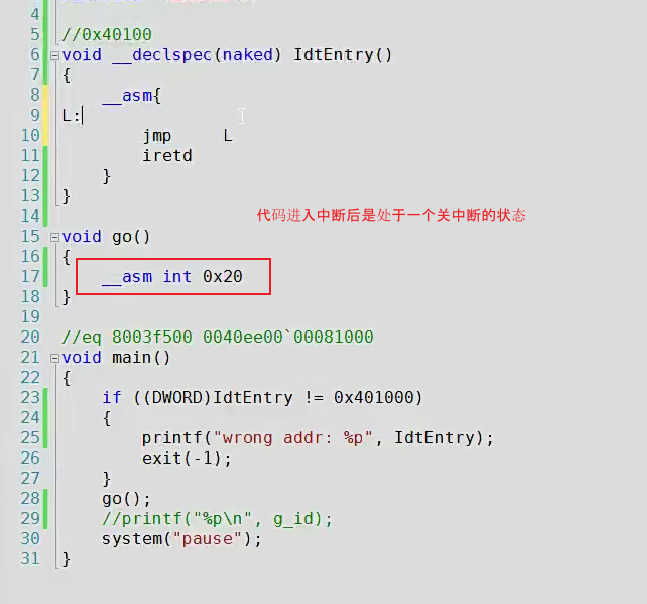
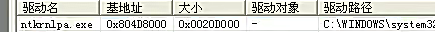
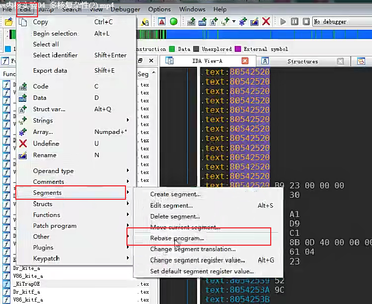
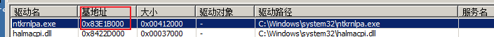
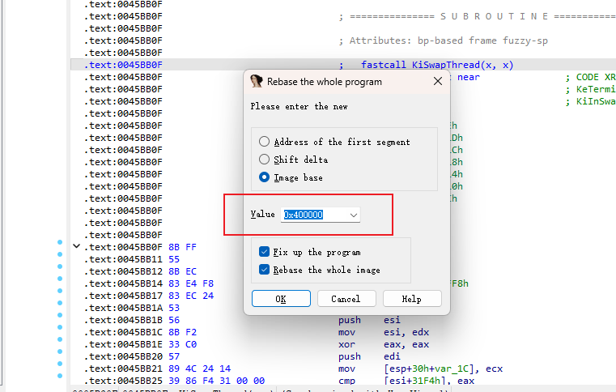
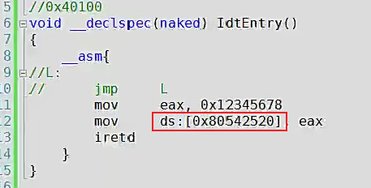
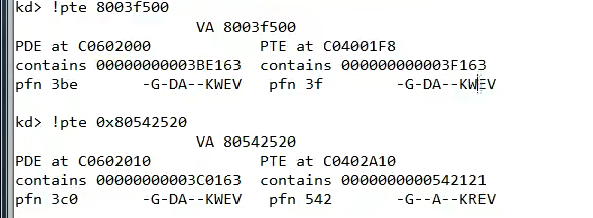

# 1

Q：代码进入中断后是一种什么状态？

A：关中断



# 2

Q: 主要的系统模块是什么？

A:主要的系统模块 涉及内存管理、文件管理、驱动管理等。。



# 3

Q：ida中的基址重定位怎么操作？

A：基址重定位，使文件和当前的虚拟机基地址保持一致，使得ida里面的地址和虚拟机里面实际跑的地址是一致的（使用方便，好找位置）






# 4

Q:如何查看页属性？

A：

`0: kd> r idtr`

```C
0: kd> r idtr
idtr=80b99400
0: kd> dq 80b99400 l40
ReadVirtual: 80b99400 not properly sign extended
80b99400  83e58e00`00089fc0 83e58e00`0008a150
80b99410  00008500`00580000 83e5ee00`0008a5c0
80b99420  83e5ee00`0008a748 83e58e00`0008a8a8
80b99430  83e58e00`0008aa1c 83e58e00`0008b018
80b99440  00008500`00500000 83e58e00`0008b478
80b99450  83e58e00`0008b59c 83e58e00`0008b6dc
80b99460  83e58e00`0008b93c 83e58e00`0008bc2c
80b99470  83e58e00`0008c2fc 83e58e00`0008c6b0
80b99480  83e58e00`0008c7d4 83e58e00`0008c914
80b99490  00008500`00a00000 83e58e00`0008ca80
80b994a0  83e58e00`0008c6b0 83e58e00`0008c6b0
80b994b0  83e58e00`0008c6b0 83e58e00`0008c6b0
80b994c0  83e58e00`0008c6b0 83e58e00`0008c6b0
80b994d0  83e58e00`0008c6b0 83e58e00`0008c6b0
80b994e0  83e58e00`0008c6b0 83e58e00`0008c6b0
80b994f0  83e58e00`0008c6b0 84248e00`00087af8
80b99500  0040ee00`00081000 00000000`00080000
80b99510  00000000`00080000 00000000`00080000
80b99520  00000000`00080000 00000000`00080000
80b99530  00000000`00080000 00000000`00080000
80b99540  00000000`00080000 00000000`00080000
80b99550  83e5ee00`0008963a 83e5ee00`000897c0
80b99560  83e5ee00`000898fc 83e5ee00`0008a498
80b99570  83e5ee00`00088fee 83e58e00`0008c6b0
80b99580  83e58e00`000886b0 83e58e00`000886ba
80b99590  83e58e00`000886c4 83e58e00`000886ce
80b995a0  83e58e00`000886d8 83e58e00`000886e2
80b995b0  83e58e00`000886ec 84248e00`00087104
80b995c0  83e58e00`00088700 83e58e00`0008870a
80b995d0  83e58e00`00088714 83e58e00`0008871e
80b995e0  83e58e00`00088728 83e58e00`00088732
80b995f0  83e58e00`0008873c 83e58e00`00088746
```

`查看页属性0: kd> !pte 80b99500`

```C
0: kd> !pte 80b99500
                    VA 80b99500
PDE at C0602028            PTE at C0405CC8
contains 0000000000193063  contains 0000000000B99163
页目录表						页表
pfn 193       ---DA--KWEV  pfn b99       -G-DA--KWEV
W表示可写 	这两个有一个不可写就不可写

```

后面那个可读不可写 所以不可以写

# 5

Q：在ds段中的任何地址都是可写的吗？

A：不一定都是可写的 有的地方会直接蓝屏！（查看**页属性**）



查看页属性



后面那个可读不可写 所以不可以写

解决方法：

①把属性R改成W

②把CPU的写保护给关了（CPU里面CR0写保护），产生异常也不报告


# 6

Q：关闭CR0写保护的方法代码？

A：

```C
mov eax,cr0
and eax,not 10000h //取反把1弄成0 关闭写保护
mov cr0, eax
```

# 7

Q:单核和多核情况下的不同？

A：在单核情况下：关闭页保护后修改内存是可以生效的，因为我们知道我们进入了死循环，如果不可以生效的话，会在死循环前就蓝屏。

在多核情况下：我们是在某个核下进行修改内存并且进入死循环，死的只是这一个核，当另外一个核访问这段代码的时候会触发异常。

**多核挂钩比单核挂钩远远复杂**

`cr0保护关闭 单核多核区别`:

```C
#include "stdafx.h"
#include <stdio.h>
#include <stdlib.h>
#include <Windows.h>

DWORD temp = 0;

void __declspec(naked) IdtEntry()
{
	__asm {
		mov eax,cr0
		and eax,not 10000h //取反把1弄成0 关闭写保护
		mov cr0, eax
		
		mov eax, 0xFFFFFFFF
		mov ds:[0x83E1B000], eax
L:
		jmp L
		iretd
	}
}

void go()
{
	__asm int 0x20
}

void main()
{

	if ((DWORD)IdtEntry != 0x401000)
	{
		printf("wrong addr: %p\n", IdtEntry);
		exit(-1);
	}
	go();
	printf("%p\n",temp);
	system("pause");
}
```

